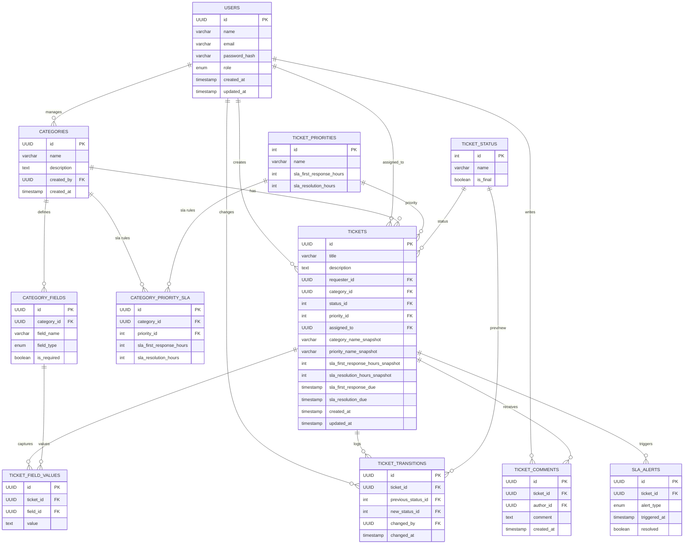

```mermaid
erDiagram
    USERS {
        UUID id PK
        varchar name
        varchar email
        varchar password_hash
        enum role
        timestamp created_at
        timestamp updated_at
    }

    CATEGORIES {
        UUID id PK
        varchar name
        text description
        UUID created_by FK
        timestamp created_at
    }

    CATEGORY_FIELDS {
        UUID id PK
        UUID category_id FK
        varchar field_name
        enum field_type
        boolean is_required
    }

    TICKET_PRIORITIES {
        int id PK
        varchar name
        int sla_first_response_hours
        int sla_resolution_hours
    }

    CATEGORY_PRIORITY_SLA {
        UUID id PK
        UUID category_id FK
        int priority_id FK
        int sla_first_response_hours
        int sla_resolution_hours
    }

    TICKETS {
        UUID id PK
        varchar title
        text description
        UUID requester_id FK
        UUID category_id FK
        int status_id FK
        int priority_id FK
        UUID assigned_to FK

        varchar category_name_snapshot
        varchar priority_name_snapshot
        int sla_first_response_hours_snapshot
        int sla_resolution_hours_snapshot
        timestamp sla_first_response_due
        timestamp sla_resolution_due

        timestamp created_at
        timestamp updated_at
    }

    TICKET_FIELD_VALUES {
        UUID id PK
        UUID ticket_id FK
        UUID field_id FK
        text value
    }

    TICKET_STATUS {
        int id PK
        varchar name
        boolean is_final
    }

    TICKET_TRANSITIONS {
        UUID id PK
        UUID ticket_id FK
        int previous_status_id FK
        int new_status_id FK
        UUID changed_by FK
        timestamp changed_at
    }

    TICKET_COMMENTS {
        UUID id PK
        UUID ticket_id FK
        UUID author_id FK
        text comment
        timestamp created_at
    }

    SLA_ALERTS {
        UUID id PK
        UUID ticket_id FK
        enum alert_type
        timestamp triggered_at
        boolean resolved
    }

    USERS ||--o{ TICKETS : "creates"
    USERS ||--o{ TICKETS : "assigned_to"
    USERS ||--o{ TICKET_TRANSITIONS : "changes"
    USERS ||--o{ TICKET_COMMENTS : "writes"
    USERS ||--o{ CATEGORIES : "manages"

    CATEGORIES ||--o{ TICKETS : "has"
    CATEGORIES ||--o{ CATEGORY_FIELDS : "defines"
    CATEGORIES ||--o{ CATEGORY_PRIORITY_SLA : "sla rules"

    TICKET_PRIORITIES ||--o{ TICKETS : "priority"
    TICKET_PRIORITIES ||--o{ CATEGORY_PRIORITY_SLA : "sla rules"

    TICKETS ||--o{ TICKET_FIELD_VALUES : "captures"
    TICKETS ||--o{ TICKET_TRANSITIONS : "logs"
    TICKETS ||--o{ TICKET_COMMENTS : "receives"
    TICKETS ||--o{ SLA_ALERTS : "triggers"

    CATEGORY_FIELDS ||--o{ TICKET_FIELD_VALUES : "values"
    TICKET_STATUS ||--o{ TICKETS : "status"
    TICKET_STATUS ||--o{ TICKET_TRANSITIONS : "prev/new"
```
